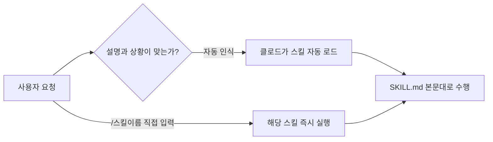

---

## layout: post
title: "클로드 코드 스킬(Skill) 정리"
date: 2026-08-31
mermaid: true

## 들어가며

클로드 코드를 처음 써보면서 실습하다가, 매번 대화를 새로 시작할 때마다 같은 지시를 반복해서 타이핑하고 있다는 걸 느꼈다.
"배운 것 정리해서 블로그에 올려줘", "질문하면 답부터 주지 말고 되물어봐줘" 같은 규칙을 매번 새로 설명해야 했다.
이걸 어떻게 줄일 수 있을지 찾다가 **스킬(Skill)** 이라는 기능을 알게 되어 오늘 이걸 공부했다.

## 스킬이란

스킬은 `SKILL.md`라는 파일 하나로 정의하는, **재사용 가능한 지시서**다.
파일은 두 부분으로 나뉜다.

- **frontmatter** — `name`, `description` 등을 적는 부분. `description`을 보고 클로드가 "지금 이 스킬을 쓸 상황인지"를 스스로 판단한다.
- **본문** — 실제로 수행할 절차를 마크다운으로 적는 부분.

이 블로그 저장소에도 이미 `.claude/skills/note/SKILL.md`, `.claude/skills/learn/SKILL.md` 파일이 있고, 이번 글도 `/note` 스킬로 쓰고 있다.

스킬을 저장하는 위치에 따라 적용 범위가 달라진다.


| 위치   | 경로                  | 적용 범위        |
| ---- | ------------------- | ------------ |
| 개인   | `~/.claude/skills/` | 내 모든 프로젝트    |
| 프로젝트 | `.claude/skills/`   | 이 저장소(repo)만 |
| 플러그인 | `<plugin>/skills/`  | 플러그인이 설치된 곳  |


## 장단점

CLAUDE.md에 규칙을 계속 추가하는 방법과 비교하면 차이가 뚜렷하다.


| 방식      | 매번 프롬프트 입력 | CLAUDE.md 규칙 | 스킬                |
| ------- | ---------- | ------------ | ----------------- |
| 반복 타이핑  | 매번 다시 씀    | 필요 없음        | 필요 없음             |
| 컨텍스트 비용 | 없음 (그때그때만) | 항상 로드됨       | 호출될 때만 로드됨        |
| 호출 방식   | 대화로 직접     | 자동 (항상 적용)   | `/이름` 또는 상황 자동 인식 |


- **장점**: 한 번 만들어두면 같은 프롬프트를 반복해서 치지 않아도 된다. 그리고 스킬 본문은 실제로 그 스킬이 호출될 때만 컨텍스트에 올라오기 때문에, CLAUDE.md처럼 매 대화마다 다 읽히지 않아 낭비가 적다.
- **단점**: 스킬 폴더 자체를 새로 만들면 바로 인식되지 않는 경우가 있어서, 터미널(세션)을 껐다 켜야 했다. 이 부분은 아래 "막혔던 것"에서 원인을 확인했다.


## 사용법

실습은 `note`, `learn` 두 스킬을 직접 만들어서 써보는 방식으로 진행했다.

```yaml
---
name: note
description: 배운 것을 학습 노트로 정리해서 블로그에 올린다. /note 라고 하면 실행한다.
---

1. 먼저 나에게 물어봐 — "뭘 배웠어요?"
2. 내 답을 가지고 `_posts/` 에 글을 만들어줘.
3. 다 쓰면 나에게 먼저 보여줘.
4. 내가 확인하면 커밋하고 push 해줘.
```

호출은 두 가지 경로로 일어난다.




실습해보니, `/note`라고 직접 치는 것과 "배운 거 정리해서 올려줘"라고 자연스럽게 말하는 것 둘 다 같은 스킬을 실행시켰다. `description`을 구체적으로 적을수록 자동 인식이 잘 됐다.

## 막혔던 것

`.claude/skills/` 아래에 스킬 폴더를 새로 만들었는데, 세션 안에서 바로 인식이 안 되는 경우가 있었다. 처음엔 오타나 문법 문제인 줄 알고 파일을 계속 고쳤는데, 알고 보니 원인이 달랐다.

공식 문서를 확인해보니, 이미 있는 스킬 폴더 안에서 파일을 수정하는 건 세션 도중에도 실시간으로 반영되지만, **세션이 시작된 이후에 최상위** `skills` **폴더 자체가 새로 생긴 경우**는 재시작을 해야 새 폴더를 감지한다는 내용이 있었다. 내가 겪은 번거로움이 바로 이 케이스였다.

## 유명한/유용한 스킬

클로드 코드에는 기본으로 들어있는 **번들 스킬**들이 있다. `/code-review`(코드 리뷰), `/debug`(디버깅), `/loop`(반복 실행), `/security-review`(보안 점검) 같은 것들이다.

Anthropic이 공식으로 공개한 [anthropics/skills](https://github.com/anthropics/skills) 저장소에는 아래 같은 예시 스킬들이 정리되어 있다.


| 분류    | 예시                             |
| ----- | ------------------------------ |
| 문서 처리 | PDF, DOCX, PPTX, XLSX 파일 생성·편집 |
| 개발    | 웹앱 테스트, MCP 서버 생성              |
| 창작    | 디자인, 아트워크 관련 작업                |


이 블로그 저장소 안에서도 `note`, `learn` 외에 `eli5`(쉬운 설명), `design`(디자인 캔버스), `dataviz`(데이터 시각화) 같은 스킬을 쓸 수 있게 되어 있었다. 다음엔 `eli5`처럼 간단하고 재밌는 나만의 스킬을 하나 만들어보고 싶다.

## 더 학습하면 좋은 개념

- **Agent Skills 공개 표준(agentskills.io)** — 스킬은 클로드 코드만의 기능이 아니라 여러 AI 도구가 함께 쓰는 공개 규격이다. 표준과 클로드 코드 전용 확장 기능을 구분해서 알아두면 좋다.
- **MCP(Model Context Protocol)** — 스킬과 자주 비교되는 또 다른 확장 방식이다. 스킬은 "지시서"에 가깝고 MCP는 "외부 도구 연결"에 가깝다는 점에서 차이를 이해할 필요가 있다.
- **서브에이전트(Subagent)** — 스킬을 별도의 격리된 실행 맥락에서 돌리는 `context: fork` 옵션이 있다. 큰 작업을 분리해서 처리하는 방식을 이해하면 스킬 설계 폭이 넓어진다.
- **플러그인(Plugin) 시스템** — 여러 스킬·훅(hook)·서브에이전트를 묶어서 배포하는 상위 단위다. 나만의 스킬이 늘어나면 다음 단계로 알아둘 만하다.


## 세 줄 요약

- 스킬은 `SKILL.md` 파일(frontmatter + 본문)로 만드는 재사용 지시서다.
- 반복 프롬프트를 안 써도 되지만, 새 스킬 폴더를 처음 만들 땐 세션 재시작이 필요할 수 있다.
- 번들 스킬과 공식 예제 저장소를 참고해서 앞으로 나만의 스킬을 더 만들어볼 예정이다.


## 참고 자료

- [Claude Code Docs - Extend Claude with skills](https://code.claude.com/docs/en/skills)
- [Claude Platform Docs - Agent Skills overview](https://platform.claude.com/docs/en/agents-and-tools/agent-skills/overview)
- [anthropics/skills (GitHub)](https://github.com/anthropics/skills)

