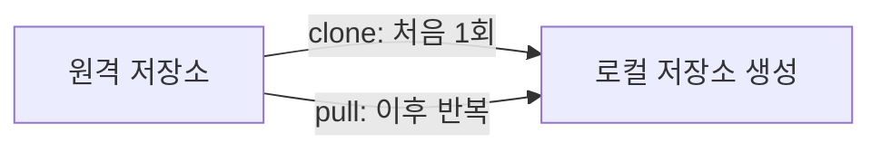
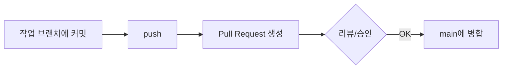

## 오늘 배운 것

### 커밋 메시지

커밋할 때 **메시지를 직접 작성**할 수 있다. 메시지는 "이 커밋에서 무엇을 바꿨는지"를 나중에 봐도 알 수 있게 남기는 용도다.

```bash
git commit -m "로그인 버튼 스타일 수정"
```

### push 전에 브랜치를 새로 만들기

`main` 브랜치에 바로 커밋하지 않고, **작업용 브랜치를 새로 만들어서 그 위에 커밋**하면 좋다.

```bash
git checkout -b feature/login-button
git add .
git commit -m "로그인 버튼 스타일 수정"
git push origin feature/login-button
```

이렇게 하면 `main`은 항상 안정된 상태로 유지되고, 새 작업은 브랜치 안에서 자유롭게 시도해볼 수 있다.

### pull과 clone은 다르다

처음에는 "pull은 clone 만들어서 파일 가져올 때 쓰는 것"이라고 이해했는데, 찾아보니 둘은 쓰는 시점이 달랐다.

| 명령 | 언제 쓰나 | 하는 일 |
|---|---|---|
| `git clone` | 저장소를 **처음** 로컬로 가져올 때 (한 번만) | 원격 저장소 전체를 통째로 복사 |
| `git pull` | 이미 clone된 저장소를 **최신 상태로 업데이트**할 때 | 원격의 새 커밋을 받아와서(fetch) 내 브랜치에 합친다(merge) |

즉 clone은 "처음 다운로드", pull은 "이미 있는 걸 최신화"라는 차이가 있다.



### Pull Request(PR)

`push`로 브랜치를 원격에 올린 뒤, `main`에 바로 합치지 않고 **Pull Request를 만들어서 병합 전에 검토를 요청**할 수 있다는 것도 알게 됐다.



## 헷갈렸던 점

`pull`이라는 이름 때문에 "저장소를 끌어오는 것 = clone과 비슷한 것"이라고 착각했다. 실제로는 **clone은 저장소 생성**, **pull은 이미 있는 저장소의 갱신**이라는 걸 구분해야 했다.

## 다음에 볼 것

- `git fetch`와 `git pull`의 차이 (pull은 fetch + merge라고 하는데, fetch만 따로 쓰는 경우는 언제인지)
- merge와 rebase의 차이
