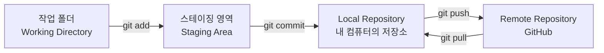
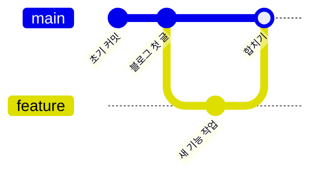
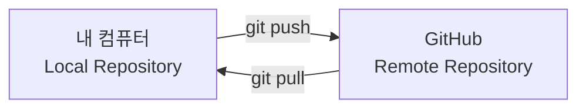
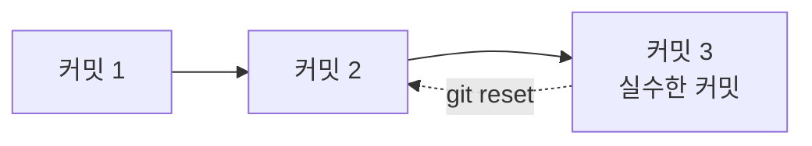

안녕하세요! 오늘은 이번 주 동안 배운 Git 명령어들을 처음부터 끝까지 한 번 쭉 정리해 보겠습니다.
Git이 어려워 보이는 이유는 개념이 여러 단계로 나뉘어 있기 때문인데, 순서대로 그림과 표로 따라가 보면 훨씬 쉽게 느껴질 거예요.

## 1. 전체 그림부터 보기

Git으로 파일을 관리할 때, 파일은 아래 네 곳 중 한 곳에 있습니다.

- **작업 폴더**: 지금 내가 파일을 수정하고 있는 공간
- **스테이징 영역**: "이번 커밋에 포함할 것"을 잠깐 모아두는 공간
- **Local Repository**: 커밋이 실제로 기록되는, 내 컴퓨터 안의 저장소
- **Remote Repository**: GitHub 서버에 있는 저장소

이 네 단계를 이동시키는 것이 바로 이번 주에 배운 명령어들입니다.

## 2. 저장소 만들기

모든 것은 저장소(Repository)가 있어야 시작됩니다.

| 명령어 | 언제 쓰나 |
|---|---|
| `git init` | 지금 있는 폴더를 Git이 관리하는 저장소로 처음 만들고 싶을 때 |

## 3. 스테이징 — 커밋에 담을 것 고르기

| 명령어 | 언제 쓰나 |
|---|---|
| `git add 파일명` | 수정한 파일 중에서 이번 커밋에 포함시키고 싶은 것을 고를 때 |
| `git add .` | 수정한 파일을 전부 한 번에 스테이징하고 싶을 때 |

## 4. 커밋 — Local Repository에 기록 남기기

| 명령어 | 언제 쓰나 |
|---|---|
| `git commit -m "메시지"` | 스테이징한 내용을 하나의 저장 지점으로 Local Repository에 기록하고 싶을 때 |

커밋은 "여기까지는 완성됐다"는 저장 지점을 남기는 것과 같아요. 이 저장 지점들이 모여 있는 곳이 바로 **Local Repository**입니다.

## 5. 브랜치 — 안전하게 나눠서 작업하기

브랜치는 원래 줄기에서 갈라져 나온 또 하나의 작업 줄기입니다. 실험적인 작업을 할 때 원본(main)에 영향을 주지 않고 따로 작업할 수 있어요.

| 명령어 | 언제 쓰나 |
|---|---|
| `git branch 브랜치명` | 새로운 브랜치를 하나 만들고 싶을 때 |
| `git switch 브랜치명` | 다른 브랜치로 이동해서 그곳에서 작업하고 싶을 때 |

위 그림처럼 `feature` 브랜치에서 따로 작업하다가, 나중에 `main`으로 다시 합칠 수 있습니다.

## 6. merge — 브랜치 합치기

| 명령어 | 언제 쓰나 |
|---|---|
| `git merge 브랜치명` | 다른 브랜치에서 작업한 내용을 지금 브랜치로 가져와 합치고 싶을 때 |

예를 들어 `main` 브랜치에 있는 상태에서 `git merge feature`를 실행하면, `feature` 브랜치의 작업 내용이 `main`에 합쳐집니다.

## 7. push / pull — 내 컴퓨터와 GitHub 주고받기

| 명령어 | 언제 쓰나 |
|---|---|
| `git push` | Local Repository에 쌓인 커밋을 GitHub(Remote Repository)로 올리고 싶을 때 |
| `git pull` | GitHub에 있는 최신 내용을 내 컴퓨터로 가져오고 싶을 때 |

내 컴퓨터에서만 작업하면 커밋은 Local Repository에만 남아요. `push`를 해야 GitHub에 있는 블로그에도 반영이 됩니다.

## 8. 되돌리기 — 실수했을 때 돌아가기

| 명령어 | 언제 쓰나 |
|---|---|
| `git reset` | 방금 한 커밋을 취소하고 그 이전 상태로 되돌리고 싶을 때 |

되돌리기는 "저장 지점 이전으로 시간을 되감는" 느낌이라고 생각하면 됩니다.

`git reset`을 하면 실수한 커밋(커밋 3) 이전 상태였던 커밋 2로 돌아갈 수 있어요.

## 정리

| 단계 | 명령어 |
|---|---|
| 저장소 만들기 | `git init` |
| 스테이징 | `git add` |
| 커밋 (Local Repository에 기록) | `git commit` |
| 브랜치 만들기 / 이동 | `git branch`, `git switch` |
| 브랜치 합치기 | `git merge` |
| GitHub로 올리기 | `git push` |
| GitHub에서 가져오기 | `git pull` |
| 되돌리기 | `git reset` |

이 8가지 흐름만 기억해두면, 앞으로 Git을 쓸 때 "지금 내가 어느 단계에 있는지"를 훨씬 쉽게 알 수 있을 거예요.
