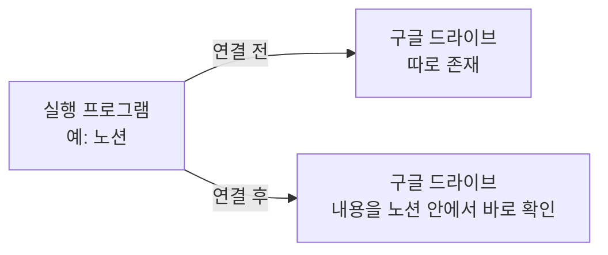
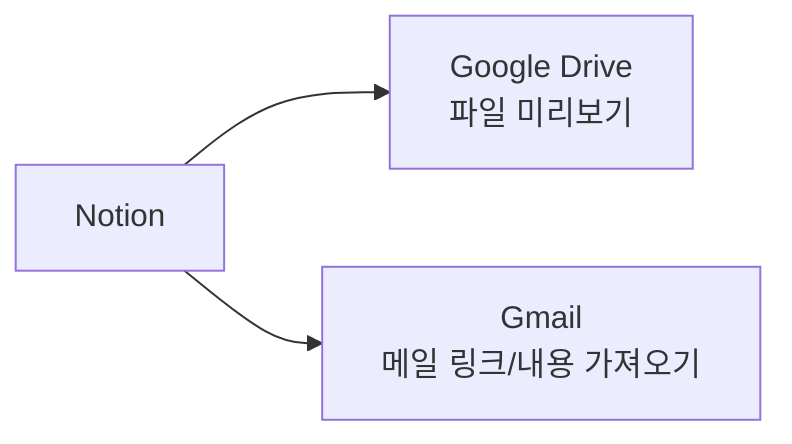
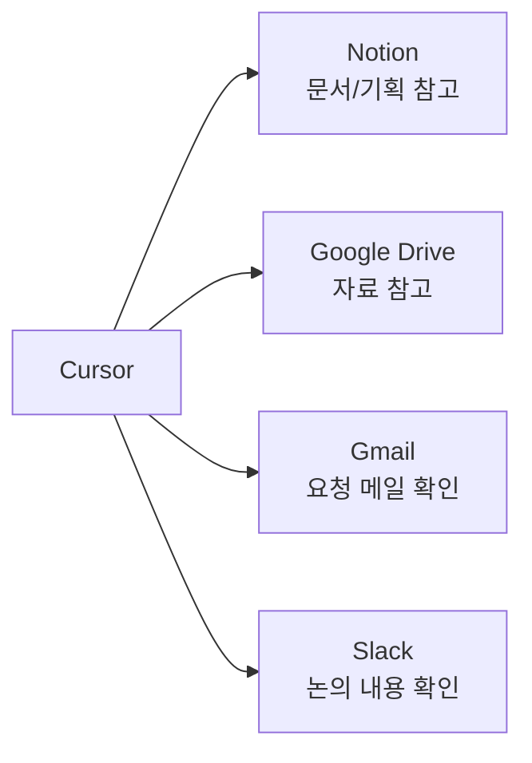
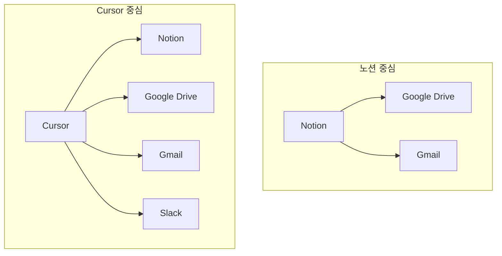

오늘은 "확장 프로그램"이라는 말이 헷갈려서 정리해봅니다.
노션(Notion)에 구글 드라이브와 Gmail을 연결하는 것과, Cursor에 노션·구글·슬랙을 연결하는 것이 뭐가 다른지 하나씩 짚어볼게요.

## 1. 확장 프로그램(연결)이 뭔가요?

노션이나 Cursor 같은 프로그램은 원래 "자기 자신의 일"만 할 수 있어요.
예를 들어 노션은 원래 노션 안의 글만 다룰 수 있고, 구글 드라이브에 있는 파일은 볼 수 없습니다.

이때 **연결(확장/플러그인)** 을 하면, 이 프로그램이 "다른 프로그램의 정보"까지 가져와서 쓸 수 있게 됩니다.

즉, **"실행 프로그램"은 내가 지금 켜서 쓰고 있는 프로그램**이고, **"연결할 프로그램"은 그 안으로 데이터를 가져올 대상**입니다.

## 2. 노션에 구글 연결하기

| 실행 프로그램 | 연결할 프로그램 | 연결하면 쓸 수 있는 것 |
|---|---|---|
| notion | google drive | 드라이브에 있는 문서/파일을 노션 페이지 안에 그대로 보여주기 |
| notion | gmail | 특정 이메일을 노션 페이지에 첨부하거나 링크로 남기기 |

노션에 연결하는 이유는 대부분 **"기록하고 정리하는 노션 페이지 안에서 다른 자료를 한눈에 보기 위해서"**입니다. 노션이 중심이 되고, 구글 서비스는 참고 자료처럼 붙는 구조예요.

## 3. Cursor에 노션·구글·슬랙 연결하기

Cursor는 원래 코드를 작성하는 프로그램입니다. 그래서 연결하는 이유가 노션과는 조금 달라요.

| 실행 프로그램 | 연결할 프로그램 | 연결하면 쓸 수 있는 것 |
|---|---|---|
| cursor | notion | 노션에 정리된 문서/기획 내용을 Cursor가 읽고 코드 작업에 참고하기 |
| cursor | google drive | 드라이브에 있는 자료(문서, 스프레드시트 등)를 Cursor가 찾아서 참고하기 |
| cursor | gmail | 메일 내용을 Cursor가 확인해서 작업(예: 요청 사항 반영)에 반영하기 |
| cursor | slack | 슬랙 대화 내용을 Cursor가 읽고, 코드 관련 논의를 작업에 반영하기 |

Cursor에 연결하는 이유는 **"코드를 짤 때 필요한 배경 정보를 직접 찾아보지 않고 Cursor가 대신 읽어오게 하기 위해서"**입니다. Cursor가 중심이 되고, 노션·구글·슬랙은 모두 "참고 자료 창고" 역할을 합니다.

## 4. 참고: Gemini는 조금 다른 연결

Gemini는 구글의 AI인데, 이건 드라이브나 Gmail처럼 "자료를 가져오는" 연결이 아니라 **Cursor 안에서 사용할 AI 모델 자체를 바꾸는 연결**입니다.

| 실행 프로그램 | 연결할 프로그램 | 연결하면 쓸 수 있는 것 |
|---|---|---|
| cursor | gemini | Cursor 안에서 코드 질문에 답하는 AI로 Gemini를 선택해서 쓰기 |

## 5. 노션 연결 vs Cursor 연결, 무엇이 다른가

| 구분 | 노션에 연결 | Cursor에 연결 |
|---|---|---|
| 중심이 되는 프로그램 | 노션 (문서/기록) | Cursor (코드 작업) |
| 연결하는 목적 | 자료를 한 페이지 안에 모아보기 | 코드 작업에 필요한 정보를 자동으로 참고하기 |
| 연결 대상 | 구글 드라이브, Gmail | 노션, 구글 드라이브, Gmail, 슬랙, (Gemini는 AI 모델 교체) |

정리하면, **"연결"은 항상 실행 프로그램이 정해져 있고, 그 프로그램이 다른 프로그램의 정보를 가져오는 것**입니다. 노션은 정리용 문서 중심으로, Cursor는 코드 작업 중심으로 연결 대상이 달라진다는 점만 기억하면 헷갈리지 않을 거예요.
