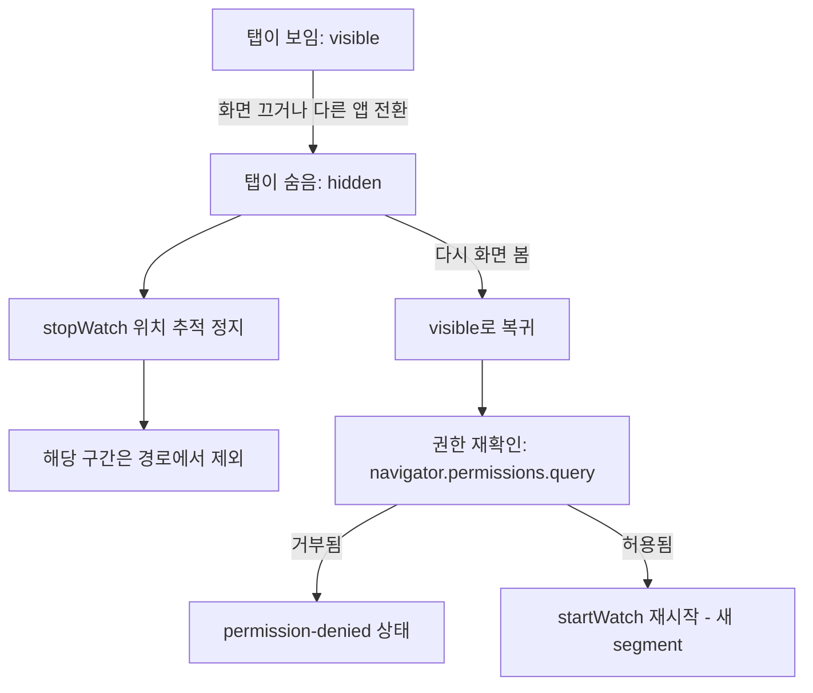

## 들어가며 (Situation)

탄천런(TancheonRun) 프로젝트에서 러닝 종료 처리를 맡아 작업하다가, `modify/` 폴더에서 기획 문서와 실제 구현이 갈라진 기록 하나를 발견했다.

> "화면을 꺼도 계속 측정"이 이번 MVP에서는 성립하지 않는다.
> — `modify/2026-09-16-background-gps.md`

기획 당시에는 앱을 전제로 "화면이 꺼지거나 다른 앱으로 전환된 동안에도 GPS 측정이 계속된다"고 적혀 있었는데, 실제로는 화면을 끄면 위치 추적이 멈춘다. 처음엔 "구현이 부족했나?" 싶었는데, 코드를 직접 찾아 읽어보기 전까지는 이게 팀의 실력 문제인지 아니면 원래 안 되는 건지조차 구분하지 못했다.

## 문제 상황 (Task)

처음 든 생각은 "AI가 짠 코드니까 나는 이해 못 해도 어쩔 수 없다"였다. 근데 다시 생각해보니, 코드를 안 짰다고 해서 "왜 이렇게 동작하는지"까지 몰라도 되는 건 아니었다. 특히 이 문제는 블로그에 그냥 "안 됐다"고 적기엔 찜찜했다 — 실제로 다음 두 가지는 완전히 다른 이야기이기 때문이다.

- 우리 팀 실력이 부족해서 못 만든 것
- 웹 브라우저라는 플랫폼 자체가 애초에 막아놓은 것

이 둘을 구분하지 않고 회고를 쓰면, 앞으로 비슷한 기능을 설계할 때도 계속 헷갈릴 것 같았다. 그래서 실제 코드(`src/app/running/useRunTracker.ts`)를 직접 열어서 근거를 찾아보기로 했다.

## 해결 과정 (Action)

### 1. 코드에서 실마리 찾기

`Ctrl+F`로 `visibilitychange`를 검색하니 다음 코드가 나왔다.

```ts
// ── 화면이 숨고 다시 보일 때(D1) ──────────────────────────────────────────
useEffect(() => {
  function onVisibilityChange() {
    if (document.visibilityState === "hidden") {
      stopWatch();
      enterGap("platform");
      if (!stoppedRef.current) setHiddenSkipped(true);
      return;
    }

    void (async () => {
      if (stoppedRef.current) return;

      // 숨어 있는 동안 사용자가 권한을 거둘 수 있다. 다시 물어본다 —
      // Permissions API 가 없으면 watch 를 걸어 보고 오류로 알게 된다.
      const state = await navigator.permissions
        ?.query({ name: "geolocation" })
        .then((result) => result.state)
        .catch(() => undefined);

      if (state === "denied") {
        setStatus("permission-denied");
        return;
      }

      gapPendingRef.current = true;
      startWatch();
      void requestWakeLock();
      scheduleFlush(0);
    })();
  }

  document.addEventListener("visibilitychange", onVisibilityChange);
  return () =>
    document.removeEventListener("visibilitychange", onVisibilityChange);
}, [enterGap, requestWakeLock, scheduleFlush, startWatch, stopWatch]);
```

`document.visibilityState`는 브라우저가 "지금 이 탭이 사용자에게 보이는지"를 알려주는 값이고, `visibilitychange`는 그 값이 바뀔 때마다 브라우저가 쏴주는 신호(Page Visibility API)다. 탭이 숨겨지면(`hidden`) `stopWatch()`로 위치 추적을 끄고, 다시 보이면 권한을 재확인한 뒤 `startWatch()`로 다시 켠다 — 단, 끊긴 구간과는 선을 잇지 않고 새 segment로 시작한다.

여기서 `startWatch`의 실제 정의도 찾아봤다.

```ts
const startWatch = useCallback(() => {
  if (stoppedRef.current || watchIdRef.current !== null) return;

  watchIdRef.current = navigator.geolocation.watchPosition(
    handleFix,
    handleError,
    GEOLOCATION_OPTIONS,
  );
  setStatus((current) => (current === "starting" ? "tracking" : current));
}, [handleError, handleFix]);
```

`navigator.geolocation.watchPosition(handleFix, handleError, ...)`는 "위치가 바뀔 때마다 `handleFix`를, 실패하면 `handleError`를 불러줘"라고 브라우저에 등록하는 호출이다. 앞의 주석("Permissions API 가 없으면 watch 를 걸어 보고 오류로 안다")은 이 등록을 미리 권한 확인 없이 그냥 시도해보고, 권한이 없으면 `handleError`가 불려서 그제서야 아는 방식이라는 뜻이었다.

### 2. "실력 문제인가 정책 문제인가" 검증하기

코드를 읽고 나니 궁금해졌다 — 이게 우리 팀이 못 짜서 생긴 제약일까? 이걸 확인하려고 스스로 질문을 던져봤다.

> 완전 고수 프론트엔드 개발자가 이 프로젝트를 통째로 웹으로 다시 만들어도, 화면을 끄면 위치가 끊겼을까?

그리고 이미 알고 있던 경험에 빗대봤다. 유튜브 앱은 일반적으로 화면을 끄면 영상이 멈추고, "프리미엄" 같은 별도 권한이 있어야 백그라운드 재생이 된다. 삼성 인터넷의 PIP(화면 속 화면) 기능도 마찬가지로 브라우저가 따로 허용해준 특별한 경우다. 구글 지도(Google Maps)처럼 세계 최고 수준 엔지니어들이 만든 사이트조차, 브라우저 탭을 백그라운드로 보내면 위치 추적이 멈춘다.

결론은 이랬다 — **브라우저가 배터리를 아끼려고, 화면에 안 보이는 탭에는 위치 정보 갱신을 일부러 막아둔 것**이다. 누가 얼마나 잘 만들든 피해갈 수 없는 플랫폼 차원의 제약이지, 우리 팀의 실력 문제가 아니었다.



### 3. 팀의 선택과 연결하기

그럼 왜 처음부터 "백그라운드에서도 되는" 방식(네이티브 앱)으로 안 만들었는지도 다시 짚어봤다. 답은 단순했다 — 부트캠프 2주짜리 1회성 프로젝트였고, 팀원 전원이 네이티브 앱 개발 경험이 없었다. 발표일까지 시간이 부족한 상태에서 새로운 기술(Swift, Kotlin 등)까지 익히는 건 현실적이지 않았다. 그래서 D1(플랫폼 결정)에서 "MVP는 Web-only"로 정했고, 그 결과로 "화면을 꺼도 측정된다"는 기획 전제가 성립하지 않게 된 것이다. 이 차이는 코드를 고치는 대신 `modify/2026-09-16-background-gps.md`에 기록으로만 남겨뒀다.

## 결과 (Result)

- "브라우저 정책 때문에 원래 안 되는 것"과 "우리 실력이 부족해서 못 만든 것"을 코드와 근거로 구분할 수 있게 됐다.
- `visibilitychange`(Page Visibility API), `watchPosition`(Geolocation API), `navigator.permissions.query`(Permissions API) 세 가지 웹 API가 실제로 어떻게 맞물려 동작하는지 코드 레벨에서 설명할 수 있게 됐다.
- 900줄짜리 파일을 전부 읽기보다, 지금 필요한 질문("왜 백그라운드 측정이 안 되는가")에 맞는 부분만 찾아 읽고 멈추는 것도 하나의 판단이라는 걸 체감했다.

## 배운 점

AI가 짠 코드를 내가 안 짰다고 해서 "몰라도 되는 코드"가 되는 건 아니었다. 코드를 그대로 베껴 설명하는 것과, 함수 하나하나를 직접 찾아 읽고 "왜 이렇게 동작하는지"를 내 말로 설명할 수 있는 것 사이엔 큰 차이가 있었다. 오늘은 딱 하나의 질문에 대한 답만 끝까지 따라가 봤는데, 그 정도로도 충분히 남는 게 있었다.

## 더 학습하면 좋은 개념

- **Page Visibility API** — `visibilitychange` 이벤트와 `document.visibilityState`의 정확한 상태값(`visible`/`hidden`) 종류와 발생 시점을 더 자세히 알아두면 좋다.
- **Geolocation API의 `watchPosition` vs `getCurrentPosition`** — 오늘은 `watchPosition`(계속 갱신)만 봤는데, 1회성 조회인 `getCurrentPosition`과의 차이를 비교하면 이해가 더 명확해진다.
- **Permissions API** — `navigator.permissions.query`로 권한 상태를 미리 확인하는 방식과, 오늘 코드처럼 "일단 시도해보고 실패로 안다"는 방식(fallback)의 차이를 정리해두면 다른 브라우저 API에도 적용할 수 있다.
- **Screen Wake Lock API** — 코드에 같이 있던 `requestWakeLock()`도 화면 꺼짐을 막아주는 별도의 API다. 위치 추적과는 무관하다는 점(오늘 배운 것과 헷갈리기 쉬운 지점)을 짚어두면 좋다.

## 참고 자료

- [MDN - Page Visibility API](https://developer.mozilla.org/en-US/docs/Web/API/Page_Visibility_API)
- [MDN - Geolocation: watchPosition() method](https://developer.mozilla.org/en-US/docs/Web/API/Geolocation/watchPosition)
- [MDN - Permissions API](https://developer.mozilla.org/en-US/docs/Web/API/Permissions_API)
- [MDN - Screen Wake Lock API](https://developer.mozilla.org/en-US/docs/Web/API/Screen_Wake_Lock_API)
